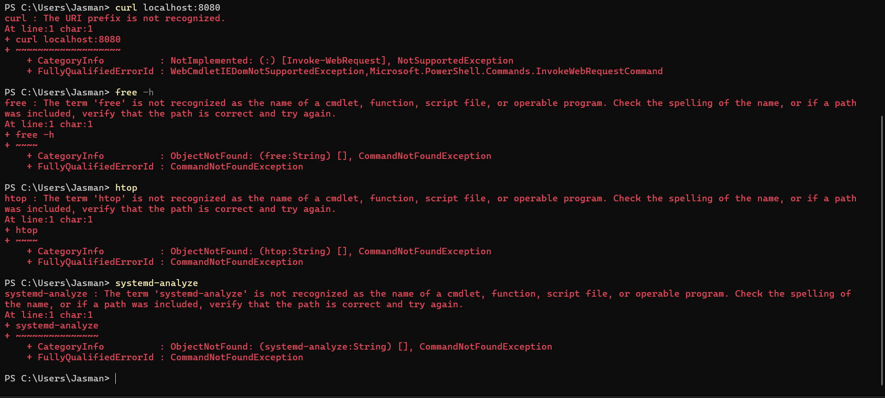

# Lab 01 – Comparison of Virtual Machines and Containers using Nginx

---

## 🎯 Aim
To deploy an Ubuntu-based Nginx web server in both a Virtual Machine and a Docker container and compare their setup process, resource usage, and operational behavior.

---

## 📌 Objectives
- Create and run an Ubuntu Virtual Machine using VirtualBox and Vagrant  
- Set up a containerized environment using Docker inside WSL  
- Deploy and verify Nginx in both environments  
- Observe and compare CPU, memory usage, and startup time  
- Understand practical differences between virtualization and containerization  

## ⚙️ Procedure

### Part A: Virtual Machine (Using Vagrant & VirtualBox)

1. The Vagrant installation was verified on the Windows host system to ensure that the provisioning tool was available and working correctly.

2. A new project directory was created to store all virtual machine configuration files. Inside this directory, an Ubuntu-based virtual machine configuration was initialized using Vagrant, which generated a `Vagrantfile`.

3. The virtual machine was started using Vagrant. During this process, the Ubuntu image was downloaded automatically and launched using VirtualBox as the hypervisor.

4. After the system booted, a secure shell (SSH) connection was established to access the Ubuntu terminal inside the virtual machine.

5. The package repositories inside the virtual machine were updated to ensure the latest software versions were available.

6. The Nginx web server was installed using the Ubuntu package manager and started as a system service.

7. The deployment was verified by sending a local HTTP request, which returned the default Nginx web page, confirming that the web server was running successfully inside the virtual machine.

---

### Part B: Container (Using WSL & Docker)

1. Windows Subsystem for Linux (WSL) was used to run an Ubuntu environment on the Windows host system.

2. The Docker engine was installed inside the WSL environment to enable container management and execution.

3. An Nginx container image was pulled from the Docker registry.

4. A Docker container was launched in detached mode, and port mapping was configured to allow access to the container’s web server from the host system.

5. The container deployment was verified by sending an HTTP request to the mapped port, which returned the default Nginx web page, confirming that the service was running correctly inside the container.

---

## 📊 Resource Observation

- CPU and memory usage inside the virtual machine were observed using system-level monitoring tools.  
- Real-time resource usage of the Docker container was observed using Docker’s built-in statistics command.  
- Startup time and responsiveness were noted for both environments during deployment and verification.

---

## 🏁 Conclusion
This experiment demonstrated the practical differences between deploying an application in a Virtual Machine and in a Docker container. The virtual machine required more system resources and longer startup time due to the presence of a complete guest operating system. In contrast, the container-based setup was faster and more lightweight, as it shared the host system’s kernel. This shows that containers are more suitable for quick and scalable deployments, while virtual machines are better for scenarios requiring strong isolation and full operating system control.

---

## 📸 Figures and Sources
All screenshots used in this experiment are also shared

